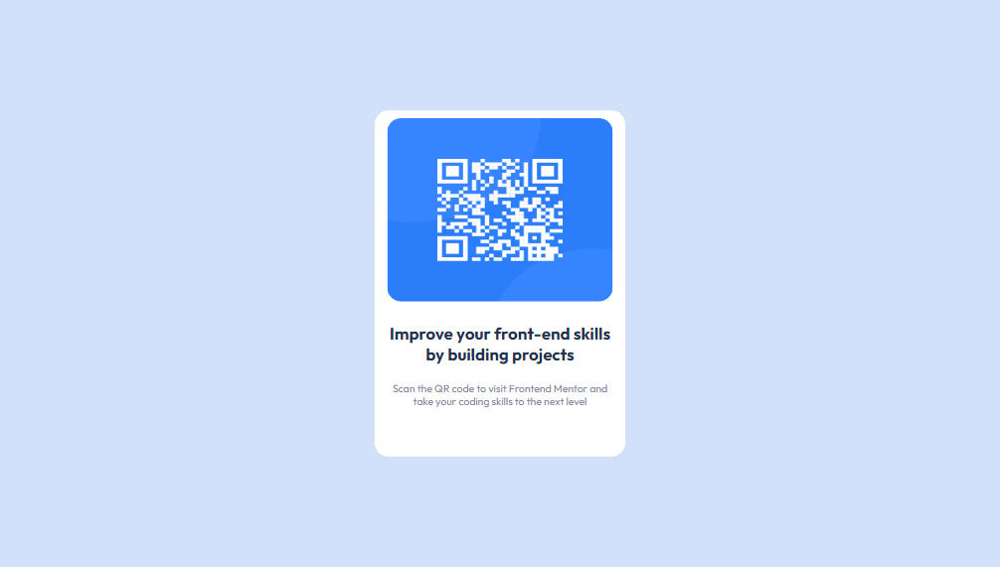

# Frontend Mentor - QR code component solution

This is a solution to the [QR code component challenge on Frontend Mentor](https://www.frontendmentor.io/challenges/qr-code-component-iux_sIO_H). Frontend Mentor challenges help you improve your coding skills by building realistic projects. 

## Table of contents

- [Overview](#overview)
  - [Screenshot](#screenshot)
  - [Link](#link)
- [My process](#my-process)
  - [Built with](#built-with)
  - [What I learned](#what-i-learned)
  - [Continued development](#continued-development)
  - [Useful resources](#useful-resources)
- [Author](#author)
- [Acknowledgments](#acknowledgments)

**Note: Delete this note and update the table of contents based on what sections you keep.**

## Overview

### Screenshot



### Link

- [Qr link](
- [Google font](https://qr-code-olive.vercel.app/) 

## My process

### Built with

- Semantic HTML5 markup
- CSS custom propertiesces**

### What I learned

In the process of building this web page, i learnt how to use flex to position the display to the center.

```html
   <div class="qr-container">...</div>
```
```css
.qr-container {
    display: flex;
    align-items: center;
    height: 100vh;
    background-color:  hsl(217, 81%, 90%);
    justify-content: center;
}
```

### Continued development

Flexbox is a major area I plan on improving on, as well as responsive designs.

### Useful resources

- [Google font](https://fonts.google.com) - This helped me when working on the fonts for my page. 

## Author

- Frontend Mentor - [@Geraldoeze](https://www.frontendmentor.io/profile/Geraldoeze)


## Acknowledgments

I would like to acknowledge my brother Emmanuel. A senior developer with lots of experience, he has always been a mentor and motivator to me. 
